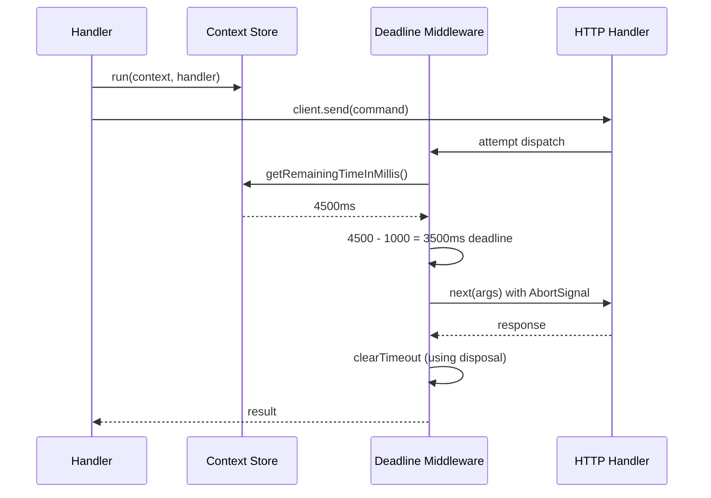

<!-- SPDX-FileCopyrightText: 2026 lambda-deadline-middleware contributors -->
<!-- SPDX-License-Identifier: MIT -->

# Architecture

Design decisions for `lambda-deadline-middleware`. Implementation-level rationale lives as comments next to the relevant
code; this document covers cross-cutting decisions and the big picture.

## Data Flow

## Design Decisions

### ESM-only

Node.js 24 has complete ESM support with working tree-shaking. Dual-package publishing introduces the dual-package
hazard (two copies of module state in one process), separate tsconfig, and ongoing maintenance. Not worth it for a
library targeting Node.js 24+.

## Conventions

### Errors

| Scenario            | Behavior                         |
| ------------------- | -------------------------------- |
| User handler throws | Propagated without wrapping      |
| Deadline exceeded   | `DeadlineExceededError`          |
| Invalid config      | `TypeError` at registration      |
| Outside Lambda      | No-op (never throws, never logs) |

### Code style

- Pure functions over classes
- `readonly` everywhere
- Discriminated unions for multi-outcome results
- No runtime `as` casts (only in branded constructors)
- "Why" comments only

## Performance

- Middleware overhead: < 50µs median
- Memory per request: one `AbortController` + one `setTimeout`
- No I/O in the middleware path
- Deterministic cleanup via `using`
