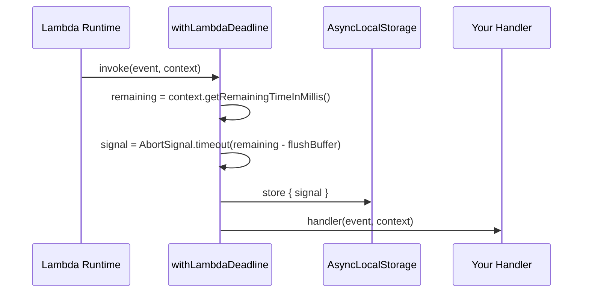
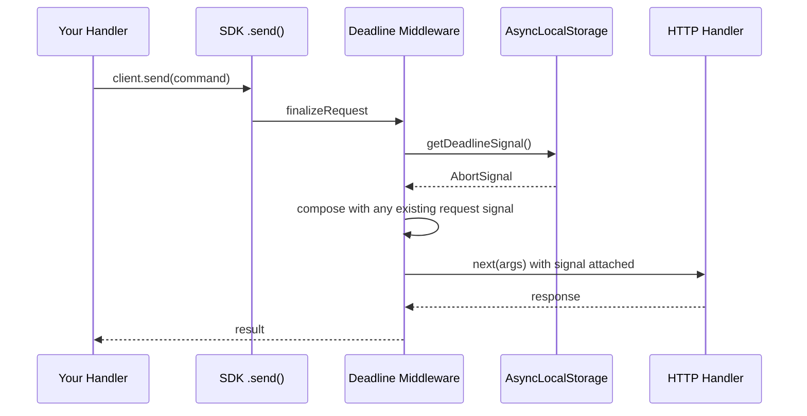
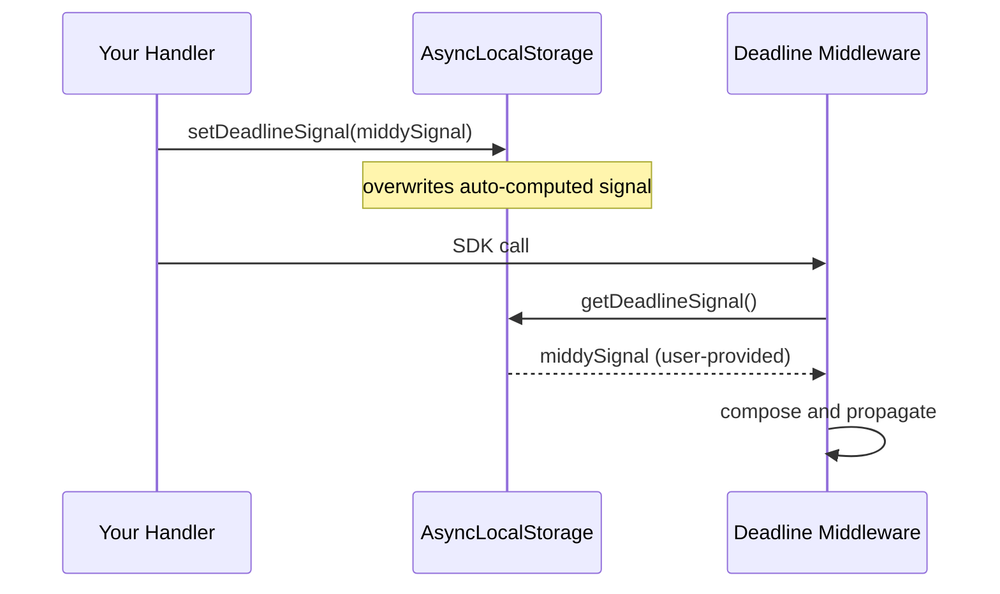

<!-- SPDX-FileCopyrightText: 2026 lambda-deadline-middleware contributors -->
<!-- SPDX-License-Identifier: MIT -->

# Architecture

Design decisions for `lambda-deadline-middleware`. Implementation rationale lives as comments in the code; this document
covers the big picture.

## Data Flow

One job: attach a deadline `AbortSignal` to every outgoing AWS SDK request within a Lambda invocation.

The signal is computed **once** at invocation start. Lambda has a single deadline (the invocation timeout), so there's
nothing to recompute per request.

### Signal creation (at handler start)

### Signal propagation (per SDK request)

### External signal path (setDeadlineSignal)

When the user provides their own signal (e.g. from Middy), it replaces the auto-computed one:

## Design Decisions

### One signal per invocation

Lambda has one deadline: the invocation timeout. The library computes one `AbortSignal.timeout()` at handler entry.
Every SDK call (including retries) shares it.

This avoids:

- Per-request `setTimeout` + `clearTimeout` overhead
- Stale deadline recomputation that gives a false sense of freshness
- Timer leak risks from incomplete cleanup

### Signal-first architecture

The middleware is trivial: "is there a signal? compose it into the request. no? pass through."

All the logic lives in `withLambdaDeadline`:

- Reads `getRemainingTimeInMillis()` once
- Validates `flushBufferMs`
- Throws `DeadlineExceededError` if there's insufficient time
- Creates the signal via `AbortSignal.timeout()`

Users who already have a signal can bypass all of this via `setDeadlineSignal()`.

### `flushBufferMs` lives on the handler wrapper, not the middleware

The flush buffer determines _when_ the signal fires relative to the Lambda timeout. That's a per-invocation decision,
not per-request. Placing it on `withLambdaDeadline` makes this explicit.

### ESM-only

Node.js 24 has full ESM support. Dual-package publishing adds the dual-package hazard, separate tsconfig, and ongoing
maintenance cost. Not worth it for a library targeting Node.js 24+.

## Conventions

### Errors

| Scenario            | Behavior                                                |
| ------------------- | ------------------------------------------------------- |
| User handler throws | Propagated without wrapping                             |
| Insufficient time   | `DeadlineExceededError` thrown before handler is called |
| Invalid config      | `TypeError` at invocation time                          |
| Outside Lambda      | No-op (no signal created, middleware passes through)    |
| External signal set | User's signal propagated; library doesn't throw itself  |

### Code style

- Pure functions over classes
- `readonly` everywhere
- No runtime `as` casts (only where TypeScript can't infer, e.g. opaque Smithy types)
- "Why" comments only

## Performance

- Middleware overhead: < 50µs median (signal check + optional `AbortSignal.any()`)
- No `setTimeout` or `clearTimeout` in the middleware path. `AbortSignal.timeout()` is created once in the wrapper.
- External signal path: near-zero overhead (no timer creation at all)
- No I/O in the middleware path
