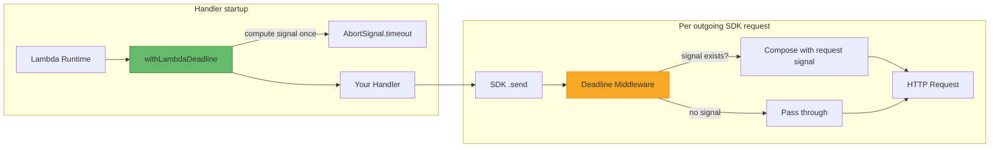

<!-- SPDX-FileCopyrightText: 2026 lambda-deadline-middleware contributors -->
<!-- SPDX-License-Identifier: MIT -->

# lambda-deadline-middleware

[](https://www.npmjs.com/package/lambda-deadline-middleware)
[](https://github.com/mikkopiu/lambda-deadline-middleware/actions/workflows/ci.yml)
[](LICENSE)

Zero-dependency AWS SDK v3 middleware that propagates Lambda deadlines to outgoing SDK calls via `AbortSignal`.

When an AWS SDK call hangs inside a Lambda, the runtime kills the process without throwing an error or giving your code
a chance to react. This library attaches an `AbortSignal` to every outgoing SDK request so your calls fail fast instead
of getting killed silently. The signal comes either from an external source you provide or is computed once from the
Lambda's remaining execution time.

```typescript
import { withLambdaDeadline, deadlineMiddleware } from "lambda-deadline-middleware";
import { DynamoDBClient, GetItemCommand } from "@aws-sdk/client-dynamodb";

const dynamodb = new DynamoDBClient({});
dynamodb.middlewareStack.use(deadlineMiddleware());

export const handler = withLambdaDeadline(async (event, context) => {
  return dynamodb.send(new GetItemCommand({ TableName: "my-table", Key: { id: { S: event.id } } }));
});
```

## Features

- Zero runtime dependencies
- Bring your own `AbortSignal` (from Middy, a manual `AbortController`, or any framework), or let the library compute
  one from `getRemainingTimeInMillis()` at invocation start
- One signal per invocation: covers all SDK calls and retries within the handler
- Works alongside per-request `abortSignal` options you pass to `.send()`
- Complete no-op outside Lambda (safe in local dev and tests)

## How It Works



`withLambdaDeadline` computes `AbortSignal.timeout(remaining - flushBuffer)` once at invocation start and stores it in
`AsyncLocalStorage`. The middleware reads it on each outgoing request and composes it with any per-request signal. If
`setDeadlineSignal()` was called, that signal is used instead.

## Requirements

- Node.js ≥ 24
- AWS SDK v3 (built against `@smithy/types` ≥ 3.0.0)

## Installation

```bash
npm install lambda-deadline-middleware
```

## Usage

Setup has two parts:

1. **Wrap your handler** with `withLambdaDeadline`. Computes the deadline signal once and stores it in
   `AsyncLocalStorage`.

2. **Register the middleware** on each SDK client.

```typescript
import { withLambdaDeadline, deadlineMiddleware } from "lambda-deadline-middleware";
import { DynamoDBClient, GetItemCommand } from "@aws-sdk/client-dynamodb";

const dynamodb = new DynamoDBClient({});
dynamodb.middlewareStack.use(deadlineMiddleware());

export const handler = withLambdaDeadline(async (event, context) => {
  const result = await dynamodb.send(
    new GetItemCommand({
      /* ... */
    }),
  );
  return { statusCode: 200, body: JSON.stringify(result) };
});
```

Every SDK call through `dynamodb` gets an `AbortSignal` that fires at `remainingTime - flushBuffer` ms from handler
start.

## External Signal (Middy, manual AbortController, etc.)

If you already have an `AbortSignal` (from Middy's `timeoutEarlyInMillis`, a manual controller, or anything else), pass
it in directly:

```typescript
import {
  withLambdaDeadline,
  deadlineMiddleware,
  setDeadlineSignal,
} from "lambda-deadline-middleware";
import middy from "@middy/core";
import { DynamoDBClient, GetItemCommand } from "@aws-sdk/client-dynamodb";

const dynamodb = new DynamoDBClient({});
dynamodb.middlewareStack.use(deadlineMiddleware());

// Middy passes { signal } as the third argument when timeoutEarlyInMillis is set
const baseHandler = async (event, context, { signal }) => {
  setDeadlineSignal(signal);
  const result = await dynamodb.send(
    new GetItemCommand({
      /* ... */
    }),
  );
  return { statusCode: 200, body: JSON.stringify(result) };
};

export const handler = withLambdaDeadline(
  middy({ timeoutEarlyInMillis: 1000 }).handler(baseHandler),
);
```

When an external signal is set via `setDeadlineSignal()`:

- It **replaces** the auto-computed signal for the current invocation
- The signal is composed with any per-request `AbortSignal` via `AbortSignal.any()`
- You control when and why the abort fires

When no external signal is set, the auto-computed signal (from `withLambdaDeadline`) is used.

**Important:** `withLambdaDeadline` must wrap the outside. It creates the `AsyncLocalStorage` scope that
`setDeadlineSignal` writes into.

```typescript
// ✅ Correct: withLambdaDeadline on the outside
export const handler = withLambdaDeadline(
  middy({ timeoutEarlyInMillis: 1000 }).handler(baseHandler),
);

// ❌ Wrong: store doesn't exist yet when baseHandler runs
export const handler = middy({ timeoutEarlyInMillis: 1000 }).handler(
  withLambdaDeadline(baseHandler),
);
```

`setDeadlineSignal` only affects AWS SDK calls (via the Smithy middleware stack). For other async work, pass the signal
yourself:

```typescript
const baseHandler = async (event, context, { signal }) => {
  setDeadlineSignal(signal);

  // SDK calls: aborted via middleware
  const item = await dynamodb.send(
    new GetItemCommand({
      /* ... */
    }),
  );

  // Non-SDK calls: pass signal manually
  const response = await fetch("https://api.example.com/data", { signal });
};
```

## Configuration

### Flush Buffer

Subtracted from remaining Lambda time to leave room for cleanup:

```typescript
// Default: 1000ms flush buffer
export const handler = withLambdaDeadline(myHandler);

// Custom: 500ms flush buffer
export const handler = withLambdaDeadline(myHandler, { flushBufferMs: 500 });
```

Only applies to automatic signal computation. With `setDeadlineSignal()`, you control timing yourself.

## Error Handling

When remaining time ≤ flush buffer, `withLambdaDeadline` throws `DeadlineExceededError` without calling the handler:

```typescript
import { isDeadlineExceeded } from "lambda-deadline-middleware";

try {
  await handler(event, context);
} catch (error) {
  if (isDeadlineExceeded(error)) {
    console.log(
      `Deadline exceeded: remaining ${error.remainingMs}ms, buffer ${error.flushBufferMs}ms`,
    );
  }
  throw error;
}
```

## Signal Composition

If you pass an `AbortSignal` to a specific SDK request, the middleware composes both. Whichever fires first wins:

```typescript
const controller = new AbortController();
setTimeout(() => controller.abort(), 2000);

await dynamodb.send(
  new GetItemCommand({
    /* ... */
  }),
  {
    abortSignal: controller.signal,
  },
);
```

## API Reference

### `withLambdaDeadline(handler, options?)`

Wraps a Lambda handler. Computes `AbortSignal.timeout(remaining - flushBuffer)` and stores it in `AsyncLocalStorage`.

```typescript
function withLambdaDeadline<TEvent, TResult>(
  handler: (event: TEvent, context: LambdaContextLike) => Promise<TResult>,
  options?: DeadlineOptions,
): (event: TEvent, context: LambdaContextLike) => Promise<TResult>;
```

### `deadlineMiddleware()`

Returns a `Pluggable` for `client.middlewareStack.use()`. Attaches the stored deadline signal to outgoing requests.

```typescript
function deadlineMiddleware(): Pluggable<object, object>;
```

### `setDeadlineSignal(signal)`

Replaces the deadline signal for the current invocation. Must be called within a `withLambdaDeadline()` scope.

```typescript
function setDeadlineSignal(signal: AbortSignal): void;
```

### `isDeadlineExceeded(error)`

Type guard for deadline-triggered errors.

```typescript
function isDeadlineExceeded(error: unknown): error is DeadlineExceededError;
```

### `DeadlineExceededError`

Thrown by `withLambdaDeadline` when `remainingTime ≤ flushBufferMs`.

```typescript
class DeadlineExceededError extends Error {
  readonly name: "DeadlineExceededError";
  readonly deadlineMs: number;
  readonly flushBufferMs: number;
  readonly remainingMs: number;
}
```

### `DeadlineOptions`

```typescript
interface DeadlineOptions {
  readonly flushBufferMs?: number; // Default: 1000
}
```

### Types

| Type                | Description                                                      |
| ------------------- | ---------------------------------------------------------------- |
| `LambdaContextLike` | Minimal interface: `{ getRemainingTimeInMillis?: () => number }` |

## Reporting Bugs

Found a bug? Please open a [GitHub Issue](https://github.com/mikkopiu/lambda-deadline-middleware/issues/new) with a
minimal reproduction, your Node.js version, and AWS SDK version. For security vulnerabilities, see
[SECURITY.md](SECURITY.md).

## Changelog

See [GitHub Releases](https://github.com/mikkopiu/lambda-deadline-middleware/releases).

## License

[MIT](LICENSE)
