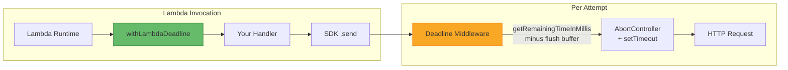

<!-- SPDX-FileCopyrightText: 2026 lambda-deadline-middleware contributors -->
<!-- SPDX-License-Identifier: MIT -->

# lambda-deadline-middleware

Zero-dependency AWS SDK v3 middleware that automatically propagates Lambda execution deadlines to outgoing SDK calls via
`AbortController`-based timeouts.

When an AWS SDK call hangs inside a Lambda function, the runtime terminates the process at the configured timeout
without throwing an error or giving your code a chance to react. This library prevents that by computing per-request
deadlines from the Lambda's remaining execution time and aborting requests before the hard timeout fires.

## Features

- Automatic deadline propagation, no manual timeout configuration per call
- Fresh deadline per retry: each SDK retry attempt uses _current_ remaining time
- Signal composition: preserves caller-provided `AbortSignal` via `AbortSignal.any()`
- Zero runtime dependencies (`@smithy/types` is compile-time only)
- Complete no-op when no Lambda context is available
- Branded types prevent millisecond/buffer interchange at compile time

## Requirements

- Node.js ≥ 24
- AWS SDK v3 (built against `@smithy/types` ≥ 3.0.0)

## Installation

```bash
pnpm add lambda-deadline-middleware
```

## Usage

Setup requires two pieces:

1. **Wrap your handler** with `withLambdaDeadline`. This stores the Lambda `context` (specifically
   `getRemainingTimeInMillis()`) in `AsyncLocalStorage` so the SDK middleware can read it. The SDK middleware stack has
   no access to the Lambda context on its own.

2. **Register the middleware** on each SDK client via the standard `middlewareStack.use()` pattern.

```typescript
import { withLambdaDeadline, deadlineMiddleware } from "lambda-deadline-middleware";
import { DynamoDBClient, GetItemCommand } from "@aws-sdk/client-dynamodb";

const dynamodb = new DynamoDBClient({});
dynamodb.middlewareStack.use(deadlineMiddleware());

export const handler = withLambdaDeadline(async (event, context) => {
  const result = await dynamodb.send(
    new GetItemCommand({
      /* ... */
    }),
  );
  return { statusCode: 200, body: JSON.stringify(result) };
});
```

Every SDK call through `dynamodb` now receives a timeout derived from the Lambda's remaining execution time minus a
configurable flush buffer (default: 1000ms).

## How It Works



`withLambdaDeadline` stores the Lambda context in `AsyncLocalStorage`. The deadline middleware reads it on every attempt
(including retries), computes a fresh timeout, and attaches an `AbortSignal` to the outgoing HTTP request.

## Configuration

### Flush Buffer

The flush buffer is subtracted from the remaining Lambda time to leave room for graceful shutdown and error handling:

```typescript
// Default: 1000ms
dynamodb.middlewareStack.use(deadlineMiddleware());

// Custom: 500ms
dynamodb.middlewareStack.use(deadlineMiddleware({ flushBufferMs: 500 }));
```

## Error Handling

When remaining time is less than or equal to the flush buffer, the middleware throws `DeadlineExceededError` immediately
without dispatching an HTTP request.

```typescript
import { isDeadlineExceeded } from "lambda-deadline-middleware";

try {
  await dynamodb.send(
    new GetItemCommand({
      /* ... */
    }),
  );
} catch (error) {
  if (isDeadlineExceeded(error)) {
    console.log(`Deadline exceeded: ${error.deadlineMs}ms`);
    console.log(`Remaining time was: ${error.remainingMs}ms`);
  }
  throw error;
}
```

## Signal Composition

If you pass an `AbortSignal` to a request, the middleware composes both signals:

```typescript
const controller = new AbortController();
setTimeout(() => controller.abort(), 5000);

await dynamodb.send(
  new GetItemCommand({
    /* ... */
  }),
  {
    abortSignal: controller.signal,
  },
);
```

## API Reference

### `withLambdaDeadline(handler)`

Wraps a Lambda handler to store the Lambda context in `AsyncLocalStorage`. Required for the middleware to access
`getRemainingTimeInMillis()`.

```typescript
function withLambdaDeadline<TEvent, TResult>(
  handler: (event: TEvent, context: LambdaContextLike) => Promise<TResult>,
): (event: TEvent, context: LambdaContextLike) => Promise<TResult>;
```

### `deadlineMiddleware(options?)`

Returns a `Pluggable` for `client.middlewareStack.use()`.

```typescript
function deadlineMiddleware(options?: DeadlineOptions): Pluggable<object, object>;
```

### `getRemainingTimeInMillis()`

Accessor for the current Lambda's remaining execution time. Returns `undefined` outside a Lambda context.

```typescript
function getRemainingTimeInMillis(): number | undefined;
```

### `isDeadlineExceeded(error)`

Type guard for deadline-triggered abort errors.

```typescript
function isDeadlineExceeded(error: unknown): error is DeadlineExceededError;
```

### `DeadlineExceededError`

```typescript
class DeadlineExceededError extends Error {
  readonly name: "DeadlineExceededError";
  readonly deadlineMs: Milliseconds;
  readonly flushBufferMs: Milliseconds;
  readonly remainingMs: Milliseconds;
}
```

### `DeadlineOptions`

```typescript
interface DeadlineOptions {
  readonly flushBufferMs?: number; // Default: 1000
}
```

### Types

| Type                | Description                                                  |
| ------------------- | ------------------------------------------------------------ |
| `Milliseconds`      | Branded number representing a duration in ms                 |
| `LambdaContextLike` | Minimal interface: `{ getRemainingTimeInMillis?(): number }` |

## Reporting Bugs

Found a bug? Please open a [GitHub Issue](https://github.com/mikkopiu/lambda-deadline-middleware/issues/new) with:

- Your Node.js version and AWS SDK version
- A minimal code snippet reproducing the problem
- Expected vs actual behavior

For security vulnerabilities, see [SECURITY.md](SECURITY.md) instead.

## License

[MIT](LICENSE)
